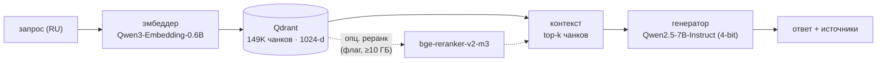

# RAGarxiv — научный RAG-ассистент по arXiv (NLP)

RAG-сервис, помогающий исследователю «сёрфить» статьи arXiv по NLP. Отвечает на два класса вопросов:

- **Q1** — «существует ли статья о X» (наличие работы / датасета / бенчмарка);
- **Q2** — «какие работы помогают с проблемой X и как» (метод + результат).

Ответ всегда опирается на найденные статьи и возвращает источники (arXiv ID + ссылка + релевантные фрагменты).

> Акцент проекта — на **оценке качества**: размеченный набор вопросов (Q1/Q2), измерение на MLflow GenAI, A/B-проверки по одному изменению за раз. По данным оценки основное ограничение качества — в генерации ответа, а не в поиске.

> Статус: **`v0.3.0`** (Фаза 2). Корпус 2021–2026 (~4 039 статей / ~149K чанков). Дорожная карта — [`docs/ROADMAP.md`](docs/ROADMAP.md); журнал экспериментов — [`docs/experiments.md`](docs/experiments.md).

## Демо

Локальный веб-интерфейс (Gradio) поверх того же движка, что у API и оценки: потоковый вывод ответа, источники сворачиваемым блоком, готовые примеры вопросов.

```bash
python src/app/gradio_app.py        # → http://localhost:7860
```

Нужны поднятый Qdrant с коллекцией `nlp2021_2026_embedtext` и GPU для 7B.


## Результаты

Базовая конфигурация `gen-7b-v4` (оценка на MLflow GenAI, судья Claude Haiku):

| метрика | что измеряет | значение |
|---|---|---|
| `doc_recall` | нужный документ попал в контекст | 0.98 |
| `relevance_to_query` | ответ по существу вопроса | 0.98 |
| `groundedness` | ответ опирается на контекст (без выдумок) | 0.83 |
| `sufficiency` | контекста достаточно для ответа | 0.78 |

Что показали эксперименты (детали — [`docs/experiments.md`](docs/experiments.md)):

- **Поиск vs генерация.** Поиск находит нужный документ почти всегда (`doc_recall` 0.98); основные ошибки — в генерации (`groundedness` 0.83): документ найден, но ответ не строго по нему.
- **Трудный набор вопросов.** На исходном наборе поиск близок к потолку (recall 0.98) — измерять улучшения не на чем. Поэтому собран более трудный набор (косвенные вопросы без терминов-подсказок), где recall@1 опускается до 0.40.
- **Реранкер.** На трудном наборе `bge-reranker-v2-m3` повышает recall@1 на 16 п.п., но требует ~1.1 ГБ видеопамяти и рядом с 7B в 8 ГБ не помещается → включается флагом `config.RERANK_ENABLED` (для GPU ≥10 ГБ).
- **Гибрид с BM25.** Ухудшил метрики (MRR −0.07): запросы на русском, документы на английском — лексического совпадения почти нет.
- **Язык ответа.** Дрейф генератора в английский/китайский на русских вопросах устранён директивой языка в конце запроса.

## Как устроено



- **Генератор:** `Qwen2.5-7B-Instruct` (4-bit) — выбран по результатам оценки (faithfulness 0.70 → 0.83 против 3B).
- **Эмбеддер:** `Qwen3-Embedding-0.6B` (GPU); документы кодируются вместе с заголовками раздела (поле `embed_text`).
- **Реранкер (опционально):** `bge-reranker-v2-m3` за флагом `config.RERANK_ENABLED` (см. раздел «Результаты»).
- **Векторная БД:** Qdrant. **Оценка:** MLflow GenAI (LLM-судья Claude Haiku через `litellm`) + детерминированный `doc_recall`.
- Единый конфиг проекта — [`src/config.py`](src/config.py).

## Структура

```
src/
  config.py           # единый конфиг: модели, Qdrant, поиск, генерация, реранк, оценка
  app/
    main.py           # FastAPI: POST /ask, POST /search
    rag_pipeline.py   # ScienceRAG: поиск (+опц. реранк) → генерация
    gradio_app.py     # локальный веб-интерфейс (чат, потоковый вывод, источники)
  eval/
    run.py            # оценка на MLflow GenAI (две фазы: генерация → судьи)
    metrics.py        # метрики MLflow (LLM-судья) + свой doc_recall
    doc_recall.py     # диагностика поиска без судьи (recall@k + MRR)
    relabel_golden.py # переразметка golden (мульти-релевантность, факты, трудные вопросы)
    retrieval_ab.py   # сравнение способов поиска: dense / +реранкер / +BM25
  pipeline/           # офлайн-сборка корпуса, стадии 01→06
docs/                 # ROADMAP.md, experiments.md
data/                 # метаданные / raw / processed / golden (gitignored)
docker-compose.yaml   # Qdrant
requirements.txt      # пины (runtime + eval + pipeline)
.env.example          # шаблон окружения
```

## Требования

- Python 3.10 (рекомендуемое имя conda-env — `ragarxiv`).
- NVIDIA GPU ≥ 8 ГБ + драйвер (torch — сборка `cu126`); работает и на CPU, но медленно.
- Docker — для Qdrant.

## Установка

```bash
# 1) окружение
conda create -n ragarxiv python=3.10 && conda activate ragarxiv   # или python -m venv
pip install -r requirements.txt

# 2) ключ Anthropic — нужен ТОЛЬКО LLM-судье при оценке (приложению не требуется)
cp .env.example .env                                     # впиши ANTHROPIC_API_KEY

# 3) Qdrant
docker compose up -d                                     # поднимает Qdrant на :6333
```

## Запуск API

```bash
cd src/app
uvicorn main:app --host 0.0.0.0 --port 8000
```

Эндпоинты:
- `POST /ask` → `{answer, sources}` — ответ LLM + источники;
- `POST /search` → `{sources}` — только поиск, без генерации.

```bash
curl -X POST localhost:8000/ask -H 'Content-Type: application/json' \
  -d '{"text": "Есть ли работа о влиянии шума в дифференциально-приватном переписывании текста?"}'
```

> Требует поднятого Qdrant с коллекцией `nlp2021_2026_embedtext` и GPU для загрузки 7B.

## Сборка корпуса (офлайн, [`src/pipeline/`](src/pipeline))

Стадии запускаются по порядку; у каждой есть `--help` и флаг `--limit` для пробного прогона. Поток данных:

```
01 метаданные → 02 HTML+parquet → 03 markdown → 04 чанки → 05 эмбеддинги → 06 индекс Qdrant
```

```bash
python src/pipeline/01_parse_metadata.py      # arXiv API → data/metadata/*.csv      (сеть)
python src/pipeline/02_parse_data.py          # скачивание HTML + parquet-файлы       (сеть)
python src/pipeline/03_preprocess.py          # HTML → markdown
python src/pipeline/04_chunk.py               # markdown → чанки (512 ток., перекрытие 50)
python src/pipeline/05_embed.py --text-field embed_text   # чанки → эмбеддинги    (GPU)
python src/pipeline/06_index_qdrant.py        # → коллекция nlp2021_2026_embedtext    (Qdrant)
```

> Корпус — 2021–2026 (стадия 02 по умолчанию; диапазон `--year-min/--year-max`). Каталог `data/` целиком gitignored.

## Оценка (MLflow GenAI, [`src/eval/`](src/eval))

В две фазы: сначала `ScienceRAG` генерирует ответы на эталонные вопросы (цикл на GPU), затем
`mlflow.genai.evaluate` оценивает их по трассировке — встроенные LLM-судьи Claude (через `litellm`) плюс
детерминированный `doc_recall`. Эталонный набор (golden) — 50 пар «вопрос–ответ» (24 Q1 / 26 Q2,
`data/eval/golden_dataset50_v2.parquet`; мульти-релевантность + атомарные факты), локальный, в git не входит.

```bash
python src/eval/run.py                          # судейский прогон (эксперимент задан в __main__)
mlflow ui --backend-store-uri ./mlruns          # просмотр результатов
python src/eval/doc_recall.py                   # быстрая проверка поиска (без судьи, бесплатно)
python src/eval/retrieval_ab.py                 # сравнение способов поиска (без судьи)
```

Результаты и история A/B — раздел [«Результаты»](#результаты) и [`docs/experiments.md`](docs/experiments.md).

## Ограничения и дальнейшие шаги

- **n=50, один прогон** — без доверительных интервалов; разницу < ~0.05 считаем шумом.
- **Сравнимость метрик.** Значения судейских метрик зависят от версии набора вопросов и судьи, поэтому между версиями напрямую не сравниваются; детерминированный `doc_recall` сравним всегда.
- **Видеопамять 8 ГБ.** 7B (4-bit) + эмбеддер ≈ 6.75 ГБ; реранкер (+1.1 ГБ) — только за флагом, на GPU ≥10 ГБ.
- **`retrieval_relevance`** (релевантность найденных документов) исключён из основной таблицы: упирался в ограничение частоты запросов к судье (засчитано 33/50). В код добавлено ограничение числа параллельных запросов — метрика вернётся при следующем прогоне.
- **Воспроизводимость.** Корпус и набор вопросов не входят в репозиторий (большие, локальные); готового снимка для запуска сторонними пользователями пока нет.
- **Дальнейшие шаги.** Более сильный генератор / больше видеопамяти (по данным — основной рычаг качества), вопросы с несколькими источниками (Фаза 3). См. [`docs/ROADMAP.md`](docs/ROADMAP.md).

## Лицензия

См. [`LICENSE`](LICENSE).
